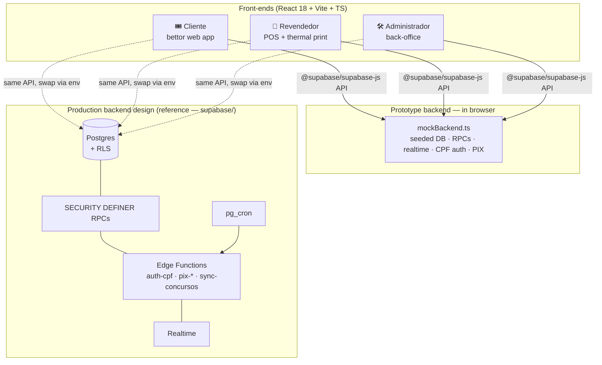
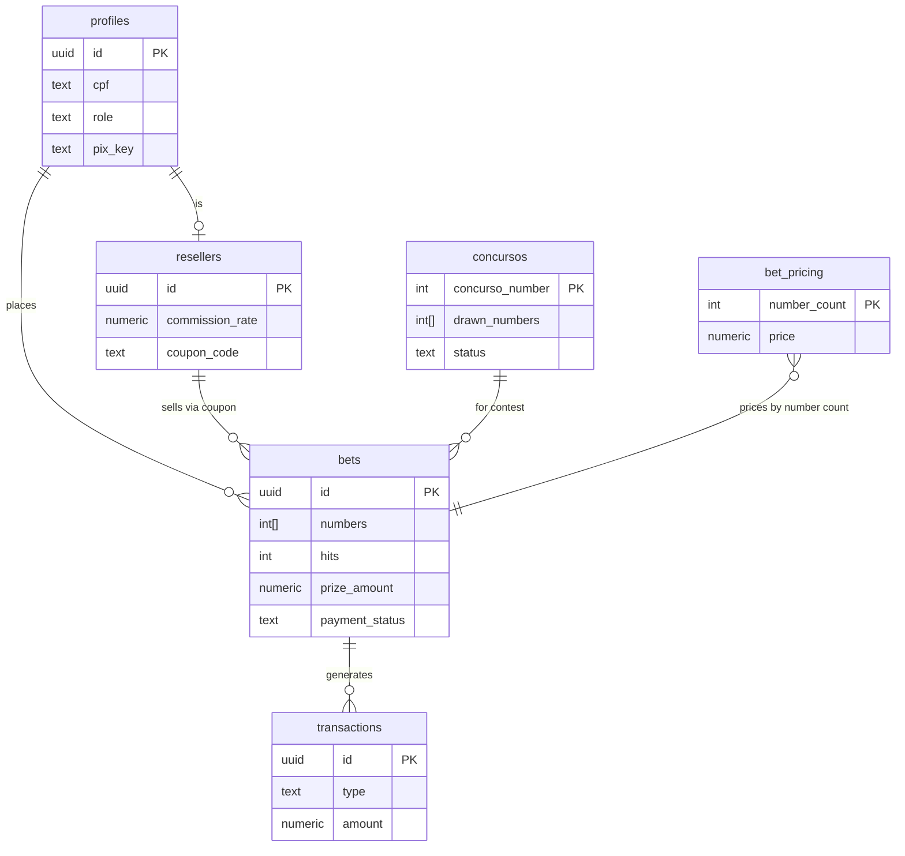

# 🍀 LuckyClover

> **A full-stack, multi-role lottery management platform** — bettor web app, reseller point-of-sale, and administrative back-office, built as an npm monorepo on React + Supabase.

<p align="center">
  
</p>

<p align="center">
  
  
  
  
  
  
</p>

---

## ⚠️ About this repository (please read)

**LuckyClover is a white-label _prototype_ built for portfolio purposes.** It is a
sanitized, self-contained reimagining of a real production lottery platform. To make it
safe to publish and instant to run:

- 🔓 **No secrets, no real backend.** Every API key, project reference, payment
  credential and personal record from the original product has been removed.
- 🧩 **The Supabase backend is emulated in the browser.** A purpose-built mock
  (`src/lib/mockBackend.ts`) reproduces the real database, RPCs, realtime channels,
  CPF authentication and PIX payment flow — seeded with realistic demo data. **Clone,
  `npm install`, `npm run dev`, and all three apps just work** with zero configuration.
- 📚 **The real backend design ships as reference.** The full Postgres schema, RLS
  policies, `SECURITY DEFINER` RPCs and Edge Functions live under [`supabase/`](supabase/)
  so you can read the production architecture even though the demo doesn't connect to it.

The **UI is in Brazilian Portuguese** (the product's real market); documentation and code
comments are in English.

---

## ✨ What it demonstrates

A single codebase covering three distinct front-ends and a rich BaaS backend:

| Capability | Where |
|---|---|
| 🎟️ **Bettor web app** — pick numbers, cart, PIX checkout, receipts, "my bets", public audit | [`apps/cliente`](apps/cliente) |
| 🏪 **Reseller POS** — sell on behalf of clients, coupons & commissions, realtime sales, **thermal ticket printing** | [`apps/revendedor`](apps/revendedor) |
| 🛠️ **Admin back-office** — dashboards, contest lifecycle, draw processing, winners, pricing, PDF/Excel reports, user management | [`apps/administrador`](apps/administrador) |
| 📱 **Android wrapper** — Capacitor build of the POS for Sunmi thermal printers *(design documented)* | [`apps/revendedor`](apps/revendedor/IMPRESSAO.md) |
| 🗄️ **Backend design** — Postgres schema, RLS, RPCs, Edge Functions, `pg_cron` sync | [`supabase/`](supabase) |
| 🔌 **Shared package** — types & helpers | [`packages/shared`](packages/shared) |

Highlighted engineering:

- **Realtime** payment confirmation and live sales feeds (Supabase Realtime channels).
- **Cascading prize distribution** engine (Sena / Quina tiers, proportional splitting).
- **Reseller commission** ledger via database triggers + transactions.
- **Custom CPF-based auth** issuing signed JWTs consumed by row-level security.
- **Client-side PDF/Excel** report generation (`jsPDF`, `xlsx`).
- **58 mm thermal printing** with SUNMI/Stone deep-link and browser fallbacks.

---

## 🚀 Quick start

```bash
git clone https://github.com/marceloaugusto95/luckyclover.git
cd luckyclover
npm install          # installs all workspaces
npm run dev          # runs all three apps at once
```

| App | Dev URL | Description |
|---|---|---|
| Cliente (bettor) | http://localhost:3001 | `npm run dev:cliente` |
| Revendedor (POS) | http://localhost:3002 | `npm run dev:revendedor` |
| Administrador | http://localhost:3003 | `npm run dev:administrador` |

### 🔑 Demo credentials

Authentication is by **CPF** (Brazilian tax ID). In the prototype **any password is
accepted** — only the CPF selects the demo account. Each app only admits its own role.

| Role | App | CPF | Notes |
|---|---|---|---|
| 👤 Client | Cliente | `111.222.333-44` | Maria Oliveira — has existing bets |
| 🏪 Reseller | Revendedor | `222.333.444-55` | Banca do João (coupon `JOAO10`) |
| 🛠️ Admin | Administrador | `000.000.000-00` | Full back-office |

> Try the end-to-end flow: in **Cliente**, build a bet → checkout → a PIX QR appears →
> the mock "bank" confirms the payment after ~4 s over a realtime channel → your receipt
> downloads. In **Revendedor**, a confirmed sale auto-prints a ticket (browser preview).

### Build for production

```bash
npm run build            # builds all three apps
npm run build:cliente    # or individually
```

Each app emits a static `dist/` — deployable to Vercel, Netlify, GitHub Pages, or any
static host.

---

## 🏛️ Architecture



The three front-ends talk to a **single client interface** (`@supabase/supabase-js`). In
the prototype that interface is served by `mockBackend.ts`; in production the identical
calls hit Supabase. Swapping between them is a matter of configuration, not code.

### Data model



See **[docs/ARCHITECTURE.md](docs/ARCHITECTURE.md)** for the full deep-dive: RLS strategy,
the custom CPF-JWT authentication, the cascading prize engine, the PIX payment lifecycle,
and how the browser mock mirrors each of them.

---

## 🧱 Tech stack

- **Frontend:** React 18, Vite, TypeScript, React Router, Zustand, Lucide icons, vanilla CSS
- **Backend (design):** Supabase — Postgres, Row-Level Security, Edge Functions (Deno), Realtime, `pg_cron`
- **Payments (design):** Mercado Pago PIX (charge creation + HMAC-validated webhooks)
- **Reports:** jsPDF + jspdf-autotable (PDF), SheetJS/xlsx (Excel)
- **Mobile:** Capacitor (Android) for SUNMI/Stone thermal printers
- **Tooling:** npm workspaces, concurrently

## 📂 Monorepo layout

```text
luckyclover/
├── apps/
│   ├── cliente/          # Bettor web app        (port 3001)
│   ├── revendedor/       # Reseller POS          (port 3002)
│   └── administrador/    # Admin back-office     (port 3003)
├── packages/
│   └── shared/           # Shared types, helpers, styles
├── supabase/
│   ├── functions/        # Edge Functions (auth-cpf, pix-*, sync-concursos) — reference
│   └── migrations/       # Schema, RLS policies, RPCs — reference
└── docs/
    └── ARCHITECTURE.md
```

Each app owns its data layer in `src/lib/` and consumes the mock via
`src/lib/mockBackend.ts`. To connect a **real** Supabase project instead, set the env vars
in each app's `.env.example` and point the `createClient` import back at
`@supabase/supabase-js`.

---

## 🔐 Security & privacy notes

- This repository contains **no credentials**. The original hardcoded keys, project
  reference, payment tokens and Android signing fingerprint were stripped and replaced
  with placeholders.
- All demo data (names, CPFs, PIX keys, phone numbers) is **synthetic**.
- The production design relies on Postgres **Row-Level Security** with per-role scope
  guards and `SECURITY DEFINER` RPCs — summarized in [docs/ARCHITECTURE.md](docs/ARCHITECTURE.md).

## 📜 License

[MIT](LICENSE) © 2026 Marcelo Augusto — portfolio project.
